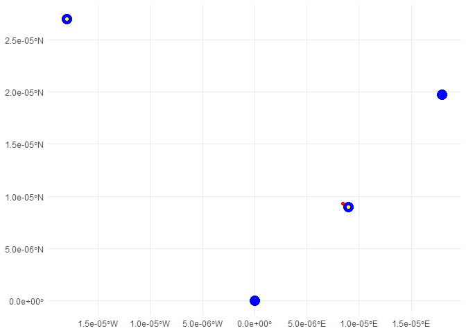
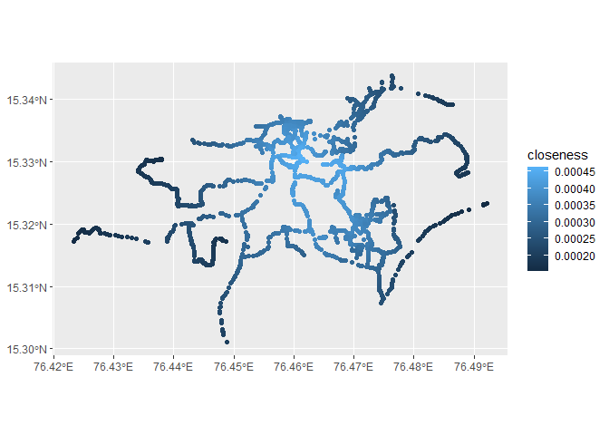
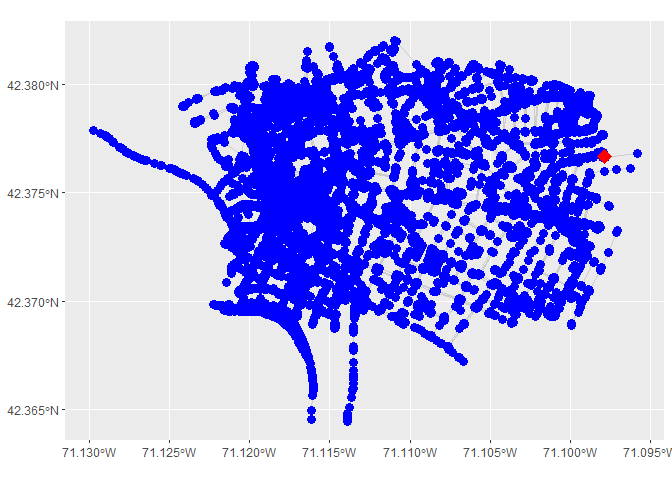

<!-- README.md is generated from README.Rmd. Please edit that file -->

# sfcentralities

<!-- badges: start -->
<!-- badges: end -->

sfcentralities allows to find central points of sf objects easily. It
offers two different functions to find central points:

st_geo_median is a vectorized algorithm to find the geometric median of
a given set of points. The geometric median is the point at which the
sum of euclidean distances to the other points are minimized.

st_closeness_centrality determines closeness centrality of points within
a street network. Distances are calculated along the network, and points
have a higher closeness within the network the lower their distance to
all other points is.

## Installation

You can install the development version of sfcentralities from
[GitHub](https://github.com/) with:

``` r
# install.packages("pak")
pak::pak("InaKrapp/sfcentralities")
```

## Examples

## st_geo_median

sffunctions offers the function st_geo_median to calculate geometric
medians from datasets with simple features.

The geometric median for a set of points is defined as the point which
minimizes the straight-line-distances to all these points. This package
uses the same underlying algorithm as the ‘pracma’ package to calculate
it, but the function is vectorized for faster computation. Furthermore,
it is designed to use sf objects as input.

``` r
# Load necessary packages
library(sf)
#> Warning: package 'sf' was built under R version 4.3.3
#> Linking to GEOS 3.11.2, GDAL 3.8.2, PROJ 9.3.1; sf_use_s2() is TRUE
library(sfcentralities)

# Create example data
pts <- st_sfc(st_point(c(0, 0)), st_point(c(1, 1)), st_point(c(2, 2.2)), st_point(c(-2, 3)))
pts <- st_as_sf(pts)
st_crs(pts) <- "EPSG:3857"

# Calculate the geometric median of the dataset
single_geometric_median <- st_geo_median(pts)
```

A geometric median can be calculated for an entire dataset, or for
subgroups within a dataset. To calculate medians for subgroups, the
column which defines the groups has to be given as second argument to
the function:

``` r
# Create an index that is 1 for the first three points and 2 for the fourth point:
pts$index <- 1
pts[4,]$index = 2

# Calculate the geometric medians for each index value separately
geometric_medians_by_group <- st_geo_median(pts, "index")
```

The returned object is a sf object which contains the geometric median
as geometry column as well as further information like a column
‘number_of_points’, the user can check how many points were used to
calculate the respective median, and ‘distance’, which contains the sum
of euclidean distances between the points and the geometric median.

Since the result is a sf object, it can be plotted easily with ggplot2:

``` r
## Plot the results:
library(ggplot2)
#> Warning: package 'ggplot2' was built under R version 4.3.3

ggplot()+geom_sf(data =pts, color = "blue", size = 5 )+geom_sf(data = geometric_medians_by_group, color = "yellow")+ geom_sf(data = single_geometric_median, color = "red")+theme_minimal()
```



Note that there are two groups in the example data: One only contains
the point in the upper right, which is therefore also returned as the
geometric median of that group. The second group contains the three
points in the lower right. The geometric median is the same as the
middle point of them. Calculating the geometric median of all points,
the point in the upper left slightly draws it to the upper left, but the
points in the lower right corner are ‘dominating’, so it is still very
close to them.

For instances where the dataset or a subgroup of the dataset has a very
low number of points, the geometric median is not defined unambiguously.
In such cases, the function will act as follows: 1. If asked to
calculate the geometric median from a single point, it will return the
point it was given. 2. If asked to calculate the geometric median from
two points, it will return the point halfway between them.

## st_closeness_centrality

Within a street network, some points can also be considered more central
than others. But unlike on a plane with straight-line distances, there
is no unique definition of centrality within a network.

This package implements the closeness centrality, which is defined as
the inverse of the sum of the distances between a certain point in a
network and all other points. In other words, the longer it would take
to travel from a point to all other points, the lower is the centrality
of this point.

This package is build on the dodgr-package, which offers highly
optimized distance calculations along graphs. It is closely integrated
with Openstreetmap, To calculate the closeness centrality for all points
within a street network, the following commands can be used:

``` r
library(dodgr)
#> Warning: package 'dodgr' was built under R version 4.3.3

# Use the hampi streetnet as example:
graph <- weight_streetnet(dodgr::hampi, wt_profile = "foot")

# Calculate closeness:
result = st_closeness_centrality(graph)
#> Input 'data' is a dodgr_streetnet graph. Calculating closeness for all its vertices.
#> Warning in max(input_graph$component_rank): no non-missing arguments to max;
#> returning -Inf
#> Using the largest connected component of the graph (containing -Inf vertices).
#> Starting distance calculation.
#> Number of elements (2270) is within 'batched_if' (1e+05). Calculating all-pairs distances.
#> Distance calculation finished.
#> Returning graph vertices with calculated closeness.

# Depict results:
ggplot()+geom_sf(data = result, aes(color = closeness))
```



Alternatively, you can supply a placename and a mode of transport to the
‘st_closeness_centrality’-function. The function will then try to
download the corresponding streetnet from OpenStreetMap.

``` r
# Calculate closeness:
result = st_closeness_centrality(placename = "hampi", transport_mode = "foot")

# Depict results:
ggplot()+geom_sf(data = result, aes(color = closeness))
```

Instead of finding a central point within a street network, one may also
wish to calculate closeness values for a certain number of points within
a city. In this case, the points for which closeness centrality should
be calculated can be supplied to the function as sf object:

``` r
# Find centrality values for specific points, providing a pre-built graph
# Use the hampi streetnet as example:
graph <- weight_streetnet(dodgr::hampi, wt_profile = "foot")

# Create three example points:
pts <- sf::st_sfc(sf::st_point(c(76.42341, 15.31717)), sf::st_point(c(76.46117, 15.33059)), sf::st_point(c(76.47491, 15.34167)))
pts <- sf::st_as_sf(pts)
sf::st_crs(pts) <- "EPSG:4326"

# Calculate closeness centrality:
pts_centrality_with_graph <- st_closeness_centrality(pts, graph = graph)
#> Input 'data' is an sf object, and a 'graph' is supplied. Using the supplied graph.
#> Warning in max(input_graph$component_rank): no non-missing arguments to max;
#> returning -Inf
#> Using the largest connected component of the graph (containing -Inf vertices).
#> Using row numbers as temporary identifiers for sf points.
#> Starting distance calculation.
#> Number of elements (3) is within 'batched_if' (1e+05). Calculating all-pairs distances.
#> Distance calculation finished.

# Depict results:
ggplot()+geom_sf(data = dodgr::hampi, color = "white")+geom_sf(data = pts_centrality_with_graph, aes(color = closeness))
```



Calculating the closeness centrality for a large number of points at
once can be computationally demanding. If the street network is larger
than a certain size or the number of points for which the closeness
should be calculated is very large, computations are therefore split up
in batches. They will take longer to be completed, but it allows such
calculations also for large networks because the data is not stored in
memory at once.

By default, batched processing is used if the closeness centrality for
more than 10000 points is calculated. This can be changed with the
parameter ‘batched_if’.

``` r
# Use the hampi streetnet as example:
graph <- weight_streetnet(dodgr::hampi, wt_profile = "foot")

# Calculate closeness: Use batched calculation even for small graphs.
result = st_closeness_centrality(graph, batched_if = 50)
#> Input 'data' is a dodgr_streetnet graph. Calculating closeness for all its vertices.
#> Warning in max(input_graph$component_rank): no non-missing arguments to max;
#> returning -Inf
#> Using the largest connected component of the graph (containing -Inf vertices).
#> Starting distance calculation.
#> Number of elements (2270) exceeds 'batched_if' (50). Calculating distances in batches.
#> Starting batched calculation for 2270 nodes with a chunk size of 50.
#>   Processing chunk: nodes 1 to 50 out of 2270.
#>   Processing chunk: nodes 51 to 100 out of 2270.
#>   Processing chunk: nodes 101 to 150 out of 2270.
#>   Processing chunk: nodes 151 to 200 out of 2270.
#>   Processing chunk: nodes 201 to 250 out of 2270.
#>   Processing chunk: nodes 251 to 300 out of 2270.
#>   Processing chunk: nodes 301 to 350 out of 2270.
#>   Processing chunk: nodes 351 to 400 out of 2270.
#>   Processing chunk: nodes 401 to 450 out of 2270.
#>   Processing chunk: nodes 451 to 500 out of 2270.
#>   Processing chunk: nodes 501 to 550 out of 2270.
#>   Processing chunk: nodes 551 to 600 out of 2270.
#>   Processing chunk: nodes 601 to 650 out of 2270.
#>   Processing chunk: nodes 651 to 700 out of 2270.
#>   Processing chunk: nodes 701 to 750 out of 2270.
#>   Processing chunk: nodes 751 to 800 out of 2270.
#>   Processing chunk: nodes 801 to 850 out of 2270.
#>   Processing chunk: nodes 851 to 900 out of 2270.
#>   Processing chunk: nodes 901 to 950 out of 2270.
#>   Processing chunk: nodes 951 to 1000 out of 2270.
#>   Processing chunk: nodes 1001 to 1050 out of 2270.
#>   Processing chunk: nodes 1051 to 1100 out of 2270.
#>   Processing chunk: nodes 1101 to 1150 out of 2270.
#>   Processing chunk: nodes 1151 to 1200 out of 2270.
#>   Processing chunk: nodes 1201 to 1250 out of 2270.
#>   Processing chunk: nodes 1251 to 1300 out of 2270.
#>   Processing chunk: nodes 1301 to 1350 out of 2270.
#>   Processing chunk: nodes 1351 to 1400 out of 2270.
#>   Processing chunk: nodes 1401 to 1450 out of 2270.
#>   Processing chunk: nodes 1451 to 1500 out of 2270.
#>   Processing chunk: nodes 1501 to 1550 out of 2270.
#>   Processing chunk: nodes 1551 to 1600 out of 2270.
#>   Processing chunk: nodes 1601 to 1650 out of 2270.
#>   Processing chunk: nodes 1651 to 1700 out of 2270.
#>   Processing chunk: nodes 1701 to 1750 out of 2270.
#>   Processing chunk: nodes 1751 to 1800 out of 2270.
#>   Processing chunk: nodes 1801 to 1850 out of 2270.
#>   Processing chunk: nodes 1851 to 1900 out of 2270.
#>   Processing chunk: nodes 1901 to 1950 out of 2270.
#>   Processing chunk: nodes 1951 to 2000 out of 2270.
#>   Processing chunk: nodes 2001 to 2050 out of 2270.
#>   Processing chunk: nodes 2051 to 2100 out of 2270.
#>   Processing chunk: nodes 2101 to 2150 out of 2270.
#>   Processing chunk: nodes 2151 to 2200 out of 2270.
#>   Processing chunk: nodes 2201 to 2250 out of 2270.
#>   Processing chunk: nodes 2251 to 2270 out of 2270.
#> Batched calculation finished.
#> Distance calculation finished.
#> Returning graph vertices with calculated closeness.

# Depict results:
ggplot()+geom_sf(data = result, aes(color = closeness))
```


