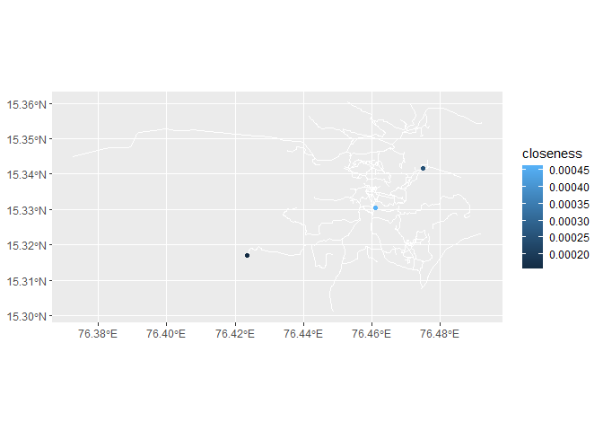
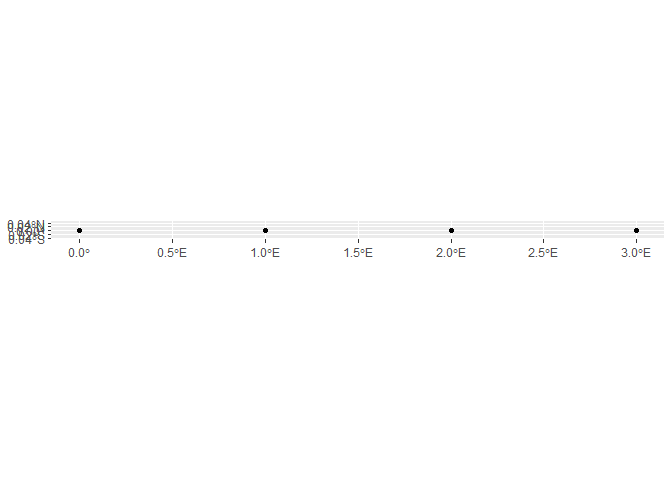

<!-- README.md is generated from README.Rmd. Please edit that file -->

# sfcentralities

<!-- badges: start -->
<!-- badges: end -->

sfcentralities allows to find central points of sf objects easily. It
offers three different functions to find central points:

st_geo_median is a vectorized algorithm to find the geometric median of
a given set of points. The geometric median is the point at which the
sum of distances to the other points are minimized.

st_network_median is an algorithm to find the central point within a
net, for example, a streetnet. It gives the most central point of a set
of points, based on distances along the streets of Openstreetmap or, if
the user prefers it, a streetnet supplied by the users.

st_network_centrality determines closeness centrality of a street
network. The most central point in a network is the network node whose
sum of distances along the network to all other nodes is the smallest.

The package also offers the function ‘st_network_distance’. This is a
function which can be used directly to compute distances between two
points. It is the basis of st_network_median.

## Installation

You can install the development version of sfcentralities from
[GitHub](https://github.com/) with:

``` r
# install.packages("pak")
pak::pak("InaKrapp/sfcentralities")
```

## Examples

## st_geo_median

sffunctions offers the function st_geo_median to calculate geometric
medians from datasets with simple features.

The geometric median for a set of points is defined as the point which
minimizes the straight-line-distances to all these points. This package
uses the same underlying algorithm as the ‘pracma’ package to calculate
it, but the function is vectorized for faster computation. Furthermore,
it is designed to use sf objects as input.

``` r
# Load necessary packages
library(sf)
#> Warning: package 'sf' was built under R version 4.3.3
#> Linking to GEOS 3.11.2, GDAL 3.8.2, PROJ 9.3.1; sf_use_s2() is TRUE
library(sfcentralities)

# Create example data
pts <- st_sfc(st_point(c(0, 0)), st_point(c(1, 1)), st_point(c(2, 2.2)), st_point(c(-2, 3)))
pts <- st_as_sf(pts)
st_crs(pts) <- "EPSG:3857"

# Calculate the geometric median of the dataset
single_geometric_median <- st_geo_median(pts)
```

A geometric median can be calculated for an entire dataset, or for
subgroups within a dataset. To calculate medians for subgroups, the
column which defines the groups has to be given as second argument to
the function:

``` r
# Create an index that is 1 for the first three points and 2 for the fourth point:
pts$index <- 1
pts[4,]$index = 2

# Calculate the geometric medians for each index value separately
geometric_medians_by_group <- st_geo_median(pts, "index")

## Look at result:
```

The returned object is a sf object which contains the geometric median
as geometry column as well as further information like a column
‘number_of_points’, the user can check how many points were used to
calculate the respective median, and ‘distance’, which contains the sum
of euclidean distances between the points and the geometric median.

Since the result is a sf object, it can be plotted easily with ggplot2:

``` r
## Plot the results:
library(ggplot2)
#> Warning: package 'ggplot2' was built under R version 4.3.3

ggplot()+geom_sf(data =pts, color = "blue", size = 5 )+geom_sf(data = geometric_medians_by_group, color = "yellow")+ geom_sf(data = single_geometric_median, color = "red")+theme_minimal()
```


Note that there are two groups in the example data: One only contains
the point in the upper right, which is therefore also returned as the
geometric median of that group. The second group contains the three
points in the lower right. The geometric median is the same as the
middle point of them. Calculating the geometric median of all points,
the point in the upper left slightly draws it to the upper left, but the
points in the lower right corner are ‘dominating’, so it is still very
close to them.

For instances where the dataset or a subgroup of the dataset has a very
low number of points, the geometric median is not defined unambiguously.
In such cases, the function will act as follows: 1. If asked to
calculate the geometric median from a single point, it will return the
point it was given. 2. If asked to calculate the geometric median from
two points, it will return the point halfway between them.

## st_closeness_centrality

Within a street network, some points can also be considered more central
than others. But unlike on a plane with straight-line distances, there
is no unique definition of centrality within a network.

This package implements the closeness centrality, which is defined as
the inverse of the sum of distances between a certain point in a network
and all other points. In other words, the longer it would take to travel
from a point to all other points, the lower is the centrality of this
point.

This package is build on the dodgr-package, which offers highly
optimized distance calculations along graphs. It is closely integrated
with Openstreetmap, To calculate the closeness centrality for all points
within a street network, the following commands can be used:

``` r
library(dodgr)
#> Warning: package 'dodgr' was built under R version 4.3.3
# Create an example streetnet from a small section of a city
# Using a bounding box for Cambridge, MA
net <- dodgr_streetnet(bbox = c(-71.12, 42.37, -71.10, 42.38), expand = 0.05)
# Get distances within the streetnet for people who walk on foot.
graph <- weight_streetnet(net, wt_profile = "foot")
#> The following highway types are present in data yet lack corresponding weight_profile values: busway, NA, elevator,
graph1 = graph[graph$component == 1,]
# Calculate closeness:
```

\`\`\`{r result_4 = st_closeness_centrality(graph1) result =
st_closeness_centrality(graph) testdistances \<-
dodgr::dodgr_distances(graph1)

points_with_all_NAs \<-
rownames(testdistances)\[rowSums(is.na(testdistances)) ==
ncol(testdistances) - 1\]

print(points_with_all_NAs) result_5 = result_4 %\>% filter(! id %in%
points_with_all_NAs) \# I should add that in my code so no Inf values
get returned. points_with_all_NAs \<-
rownames(testdistances)\[rowSums(is.na(testdistances))\> 50\]

print(points_with_all_NAs) result_6 = result_4 %\>% filter(! id %in%
points_with_all_NAs)

## Issue: Not only do some points create NA’s, but also highly skew the value of a few points which are barely reachable at the outside of the net. I can remove those which have above 50 NA’s (as done in creating result_6 above), but would need a better criterion to use this in my function.

# I can not remove all points which have any NA value to any other point since that would remove all points!

# Try removing all points which have more than the average number of NA values.

points_above_avg_na \<-
rownames(testdistances)\[rowSums(is.na(testdistances)) \>
mean(rowSums(is.na(testdistances)))\]

print(points_above_avg_na) result_7 = result %\>% filter(! id %in%
points_above_avg_na) result_8 = result_4 %\>% filter(! id %in%
points_above_avg_na)

library(dplyr) result_2 = result %\>% filter(! closeness %in% c(Inf))
%\>% filter(closeness \< 0.006)

result_3 = result %\>% filter(closeness \> 0.006)

ggplot()+geom_sf(data = result_2, aes(color =
closeness))+scale_color_viridis_c(option = “turbo”)

ggplot()+geom_sf(data = result_6, aes(color =
closeness))+scale_color_viridis_c(option = “turbo”)

ggplot()+geom_sf(data = result_7, aes(color =
closeness))+scale_color_viridis_c(option = “turbo”)

ggplot()+geom_sf(data = result_8, aes(color =
closeness))+scale_color_viridis_c(option = “turbo”)


    Alternatively, you can supply a sf object and a mode of transport to the 'st_closeness_centrality'-function:
    This is especially intended to be used for cases in which a sf object was obtained using the 'dodgr_streetnet' function or similar cases in which a sf object also represents a network.

    Calculating the closeness centrality for a large number of points at once can be computationally demanding. If the street network is larger than a certain size, computations are therefore split up in batches. They will take longer to be completed, but this allows such calculations also for large networks.

    I am also not sure if it makes much sense to have this code. The results are not very intuitive. Maybe I made some error? Why is the closeness of some boundary points so high? A more typical system can be seen in the mid if I only look at points which have relatively close values.

    Maybe the issue is that the network is not unique, it contains smaller networks within which high closeness centralities are easily obtained?

    Check if its results are the same as for st_network_median:
    ```{r
    # Create an example graph from a small section of a city
    # Using a bounding box for Cambridge, MA
     net <- dodgr_streetnet(bbox = c(-71.12, 42.37, -71.10, 42.38), expand = 0.05)
     graph <- weight_streetnet(net, wt_profile = "foot")

    # Create a set of random points within that bounding box
    # set.seed for reproducibility
     set.seed(123)
     pts <- st_sample(st_as_sfc(st_bbox(c(xmin=-71.12, ymin=42.37, xmax=-71.10, ymax=42.38))), 100)
     pts <- st_as_sf(pts)
     st_crs(pts) <- "EPSG:4326" # Set CRS to WGS84
     pts$id <- 1:nrow(pts) # Add an ID column

    # Find the most central point
     central_point2 <- st_closeness_centrality(data = pts, graph = graph)
     
     # You can visualize the result
     # (Requires ggplot2 and ggrepel)
      library(ggplot2)
      library(ggrepel)
     
      ggplot() +
        geom_sf(data = dodgr_to_sf(graph), color = "gray80") +
        geom_sf(data = pts, color = "blue", size = 3) +
        geom_sf(data = central_point2, size = 5, shape = 18, aes(color = closeness)) +
        geom_text_repel(data = central_point2, aes(label = "Central Point",
                                         geometry = x),
                        stat = "sf_coordinates", nudge_x = 0.001) +
        theme_void() +
        labs(title = "Most Central Point (Red) Among a Set of Points (Blue)")

### st_network_median

In case the user has a set of points located within a city and wishes to
find out which of these points has the highest centrality based on
distances along the city’s street network, the function
‘st_network_median’ can be used. Analog to the idea of the geometric
median as the point which minimizes euclidean distances to all points in
a set, the network median is defined here as the point which minimizes
distances along the streetnet for the given set of points. For
computational reasons (even for a relatively small street network,
considering every possible point would quickly bring a computer to its
limit) only the points within the set are treated as candidates.

# Change me please.

I should modify the geometry so the geometry of the returned object is
not ‘x’. And I should consider modifying the crs since I get a warning
saying it may be wrong for long-lat coordinates. Investigate: Where does
the warning come from?

``` r
 library(sf)
 library(dodgr)

# Create an example graph from a small section of a city
# Using a bounding box for Cambridge, MA
 net <- dodgr_streetnet(bbox = c(-71.12, 42.37, -71.10, 42.38), expand = 0.05)
 graph <- weight_streetnet(net, wt_profile = "foot")
#> The following highway types are present in data yet lack corresponding weight_profile values: busway, NA, elevator,

# Create a set of random points within that bounding box
# set.seed for reproducibility
 set.seed(123)
 pts <- st_sample(st_as_sfc(st_bbox(c(xmin=-71.12, ymin=42.37, xmax=-71.10, ymax=42.38))), 100)
 pts <- st_as_sf(pts)
 st_crs(pts) <- "EPSG:4326" # Set CRS to WGS84
 pts$id <- 1:nrow(pts) # Add an ID column

# Find the most central point
 central_point <- st_network_median(data = pts, graph = graph)
#> Calculating all-to-all network distances...
#> Central point found at index: 66

# Print the result
 print(central_point)
#> Simple feature collection with 1 feature and 2 fields
#> Geometry type: POINT
#> Dimension:     XY
#> Bounding box:  xmin: -71.11103 ymin: 42.37534 xmax: -71.11103 ymax: 42.37534
#> Geodetic CRS:  WGS 84
#>                             x id total_distance
#> 66 POINT (-71.11103 42.37534) 66       64549.12

 # You can visualize the result
 # (Requires ggplot2 and ggrepel)
  library(ggplot2)
  library(ggrepel)
#> Warning: package 'ggrepel' was built under R version 4.3.3
 
  ggplot() +
    geom_sf(data = dodgr_to_sf(graph), color = "gray80") +
    geom_sf(data = pts, color = "blue", size = 3) +
    geom_sf(data = central_point, color = "red", size = 5, shape = 18) +
    geom_text_repel(data = central_point, aes(label = "Central Point",
                                     geometry = x),
                    stat = "sf_coordinates", nudge_x = 0.001) +
    theme_void() +
    labs(title = "Most Central Point (Red) Among a Set of Points (Blue)")
#> Warning in st_point_on_surface.sfc(sf::st_zm(x)): st_point_on_surface may not
#> give correct results for longitude/latitude data
```


Does it have the same issue where boundary points are found as
particularily central?

``` r
net <- dodgr_streetnet(bbox = c(-71.12, 42.37, -71.10, 42.38), expand = 0.05)
# Get distances within the streetnet for people who walk on foot.
graph <- weight_streetnet(net, wt_profile = "foot")
#> The following highway types are present in data yet lack corresponding weight_profile values: busway, NA, elevator,
graph1 = graph[graph$component == 1,]
v <- dodgr_vertices (graph1)
v2 = st_as_sf(v,coords = c("x", "y"))
st_crs(v2) = "EPSG:4326"

test = st_network_median(v2, graph = graph1)
#> Calculating all-to-all network distances...
#> Central point found at index: 9186


 ggplot() +
    geom_sf(data = dodgr_to_sf(graph1), color = "gray80") +
    geom_sf(data = v2, color = "blue", size = 3) +
    geom_sf(data = test, color = "red", size = 5, shape = 18)
```

 Yes,
the issue occurs. So I need to create both functions more stable against
issues where, even though only the largest component of the graph is
analyzed, ‘side’ points which can’t reach some other points are
calculated to have high closeness because only the distances to the few
points they can reach are calculated.

I think it may be reasonable to fortify st_network_distance against this
issue and use it as basis for st_network_median as well as
st_network_centrality. Or is it? I’ll have to think about this. Maybe,
st_network_centrality tries to do too many things at once. Maybe I
should separate more strictly: One for dodgr graphs, one for sf objects?
Or only keep st_network_median and use vertices from a street net as
input? I could do that, but it doesn’t have the optimized
large_batch_logic. I think the best way may be to act as follows: 1.
Remove option to add aditional sf data to st_closeness_centrality -
st_closeness_centrality should only work on a network/dodgr_graph. 2.
Modify st_network_median so it returns the entire sf object with
closeness values, not only a single value/median. Then, it can replace
the sf data from st_closeness_centrality entirely. 3. Ensure both
against the borderline values error.

The test graph is not created correctly yet.

``` r
# Load necessary libraries for testing
library(testthat)
library(sf)
library(dodgr)

# --- Sourcing the functions to be tested ---
# (Ensure st_network_distance and find_central_point are loaded)

# --- Test Suite ---
# --- 1. Setup a predictable test environment ---

# Create vertices data frame with ID, longitude (x), and latitude (y)
v_linear <- data.frame(
  id = 1:4,
  x = c(0, 1, 2, 3),
  y = rep(0, 4)
)

# Create edges data frame referencing vertex IDs
edges_linear <- data.frame(
  from_id = c(1, 2, 3),
  to_id = c(2, 3, 4)
)

# --- CORRECT METHOD: Construct an sf object with LINESTRINGs ---

# Create a list to hold the LINESTRING geometries
linestrings <- list()
# For each edge, look up the coordinates of its start and end points
# and create a LINESTRING.
for (i in 1:nrow(edges_linear)) {
  from_node <- edges_linear$from_id[i]
  to_node <- edges_linear$to_id[i]
  
  # Get coordinates for the start and end of the line
  from_coords <- v_linear[v_linear$id == from_node, c("x", "y")]
  to_coords <- v_linear[v_linear$id == to_node, c("x", "y")]
  
  # Create a matrix of the two points
  line_matrix <- as.matrix(rbind(from_coords, to_coords))
  
  # Create the LINESTRING and add it to our list
  linestrings[[i]] <- sf::st_linestring(line_matrix)
}

# Convert the list of linestrings into a simple features geometry column (sfc)
sfc_network <- sf::st_sfc(linestrings, crs = 4326)

# Create the final sf object. This is the object weight_streetnet expects.
sf_network <- sf::st_sf(geometry = sfc_network)

# column "highway" and give it a generic value that is walkable.
sf_network$highway <- "path"

# Now, call weight_streetnet with the correct sf object.
# It will correctly process the LINESTRINGs to build a routable graph.
graph_linear <- dodgr::weight_streetnet(sf_network, wt_profile = "foot")
#> x appears to have no ID column; sequential edge numbers will be used.

# Create the corresponding sf points for testing the function (this part remains the same)
pts_linear <- sf::st_as_sf(v_linear, coords = c("x", "y"), crs = 4326)
# Add character ID to match what dodgr produces from vertices.
pts_linear$id <- as.character(pts_linear$id)

ggplot()+geom_sf(data = pts_linear)
```



Note that if two points are similarily central in such a network, the
function will return only one of them. Due to floating point issues, a
warning may not be send.

### st_network_distance

Calculating distance along street networks can offer more accurate
results than straight-line distances. The function ‘st_network_distance’
allows the user to calculate street distances on sf objects using the
dodgr package. The st_geo_median-function makes use of this, users can
also use it to create their own centrality measures.

The dodgr package is able to calculate distances along networks with
high efficiency, taking into account aspects like different modes of
transport. It is particularly well-integrated with Openstreetmap, so the
typical use case is to let the function calculate distances along the
streetnet of Openstreetmap. The user can either supply a streetnet they
created before or define a place and a mode of transport. In the latter
case, the streetnet will automatically be downloaded from Openstreetmap.

The st_network_distance function can be used in a number of ways: 1.
Supplying a single sf object. In this case, it calculates distances
between all points in the object:

``` r
pts <- sf::st_sfc(sf::st_point(c(76.47398, 15.330)), sf::st_point(c(76.47398, 15.150)))
  pts <- sf::st_as_sf(pts)
  sf::st_crs(pts) <- "EPSG:4326"
  # Calculate distance
  result <- st_network_distance(data = pts, placename = "hampi", transport_mode = "bicycle")
#> The following highway types are present in data yet lack corresponding weight_profile values: bus_stop,
```

2.  Supplying two sf objects. In this case, the distances from all
    points of the first object to all points of the second object are
    calculated. If the user wants the reverse distances, they can switch
    the order of the inputs. It is important to keep in mind that in
    road networks, the distance from point A to point B can be different
    from the distance from point B to point A, f.eg. because of one-way
    streets or construction sites.
    `{r pts <- sf::st_sfc(sf::st_point(c(76.47398, 15.330)), sf::st_point(c(76.47398, 15.150)))   pts <- sf::st_as_sf(pts)   sf::st_crs(pts) <- "EPSG:4326"   pts2 <- pts[1, ]   # Calculate distance   result <- st_network_distance(data = pts, to = pts2, placename = "hampi", transport_mode = "bicycle")`
    The distances are appended as new columns to the first sf object.
    They contain the distances to the points of the second object in
    descending order: ‘distance_to_1’ is the distance to the point of
    the first row in the second sf object, ‘distance_to_2’ is the
    distance to the point of the second row and so on. For easier
    oversight, it may make sense to supply names. For example, if the
    user wants to calculate the distance to two points named ‘city
    center’ and ‘train_station’, they can name the calculated distances
    after them using the ‘index’ parameter of the function:
    `{r pts <- sf::st_sfc(sf::st_point(c(76.47398, 15.330)), sf::st_point(c(76.47398, 15.150)))   pts <- sf::st_as_sf(pts)   sf::st_crs(pts) <- "EPSG:4326"   pts$name = c("city center", "train station")   # Calculate distance   result <- st_network_distance(data = pts, to = pts, placename = "hampi", transport_mode = "bicycle", index = "name")`
    A function like this supplies the name of an area (‘placename’) to
    Openstreetmap and takes the street network from there. This approach
    requires a working internet connection, and especially for distances
    between places which are far apart (f.eg. in different cities), it
    may fail when it attempts to download too large street networks.

Therefore, it may be more efficient for the user to download the street
network and give it directly into the function. This allows, for
example, to download it once and save it locally for later uses, or to
modify it. Here is example code to create a graph:

``` r
  bb <- osmdata::getbb(place_name = "hampi")
  net <- dodgr::dodgr_streetnet(bb)
  graph <- dodgr::weight_streetnet(net, wt_profile = "bicycle")
#> The following highway types are present in data yet lack corresponding weight_profile values: bus_stop,
```

The graph can then be supplied to the st_network_distance function as
follows:

``` r
result <- st_network_distance(data = pts, to = pts, graph = graph)
```

Note that supplying a placename or a mode of transport is no longer
needed; when they were supplied previously, they were used to create the
graph internally. If a graph is supplied, they are therefore ignored.

Finally, it is possible to create the times instead of the distances by
setting ‘calculate_times’ to True:

``` r
  result_times <- st_network_distance(data = pts, to = pts, placename = "hampi", transport_mode = "bicycle", calculate_times =  TRUE)
#> The following highway types are present in data yet lack corresponding weight_profile values: bus_stop,
```

You’ll still need to render `README.Rmd` regularly, to keep `README.md`
up-to-date. `devtools::build_readme()` is handy for this.
